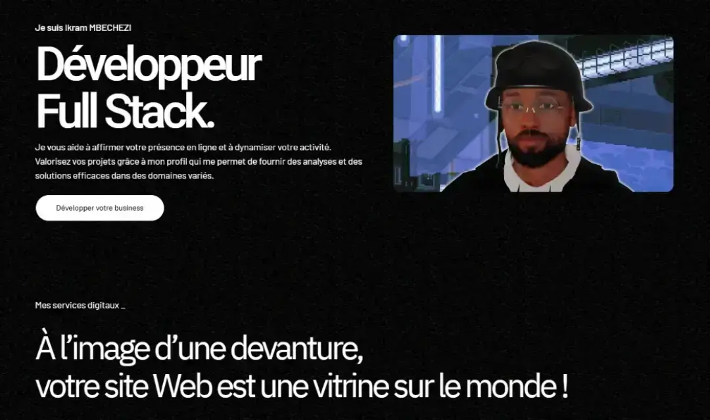

<h1>👋 Hey, je suis Ikram Mbechezi</h1>

**`Développeur Full Stack (Co-Fondateur Train De Vies).`**

Bien plus que développeur, je réunis divers domaines de l'IT afin de créer une synergie entre visuel et fonctionnel. Curieux et dévoué à ce secteur, je peux porter plusieurs casquettes, de chef de projet à créateur de contenu.

<div align="left" style="margin-bottom: 50px;">
	<a href="https://traindevies.com" target="_blank">
	  
	</a>
	<a href="https://fr.linkedin.com/in/ikram-mbechezi" target="_blank">
	  
	</a>
	<a href="https://mbechezi.website" target="_blank">
	  
	</a><br /><br />
	<p>
		<span>📩 Pour me contacter :</span><br/>
		<a href="https://www.linkedin.com/in/ikram-mbechezi" target="_blank">
		 LinkedIn
		</a><br/>
		<a href="mailto:Mbechezi.Ikram@gmail.com" target="_blank">
		 Mbechezi.Ikram@gmail.com
		</a>
	</p>
</div>

---
<br />

<h2>👨‍🚀 Mes derniers projets</h2>
<div align="center">
	<table>
        <tr>
			<td width="50%">
				<h3 align="center">Train De Vies</h3>
				<div align="center">
                    <a href="https://traindevies.com" target="_blank" rel="noreferrer">
					 </a>
                    <p align="center">Application Web et Site E-commerce dédié aux créateurs digitaux.</p>
				</div>
            </td>
            <td width="50%">
                <h3 align="center">Mon Portfolio</h3>
                <div align="center">
                    <a href="https://mbechezi.website" target="_blank" rel="noreferrer">
					 </a>
                    <p align="center">Mon portfolio de Développeur Full Stack.</p>
                </div>
            </td>
        </tr>
  </table>
</div>
<br />
<br />
<br />

<h2>🚀 Mes dépôts phares</h2>
<div align="center">

[](https://github.com/IkramMbz/ADBot)

[](https://github.com/IkramMbz/Mosaique-solitaire)

[](https://github.com/IkramMbz/PersonaDB)
</div>
<br />
<br />
<br />

<h2>🛠️ Langages et Outils.</h2>
<div align="center" style="flex gap-4">
	
	
	
	
	
	
	
	
	
	
	
	
	
	
	
	
	
	
	
	
	
	
	
	
	
	
	
	
	
	
	
	
	
	
	
	
	
	
	
	
	
	
</div>
<br />
<br />
<br />

<!--<div>
<h3>📊 Stats #Nouveau Compte.</h3>


</div><br />
-->

<div class="ikram">
	<br />
	<br />
	<br />
	<a href="https://mbechezi.website" style="border-radius: 100%; background-color: red; background-color: '#faff00';">
	  
	</a>
	<br />
	<br />
	<br />

```javascript
import * from 'my-skills'

function greetings() {
	let ikramMbechezi = '👋 Je mets au service de vos projets mes compétences de développeur invétéré mais par-dessus tout :';
	return <Passion />
}
```
</div>
